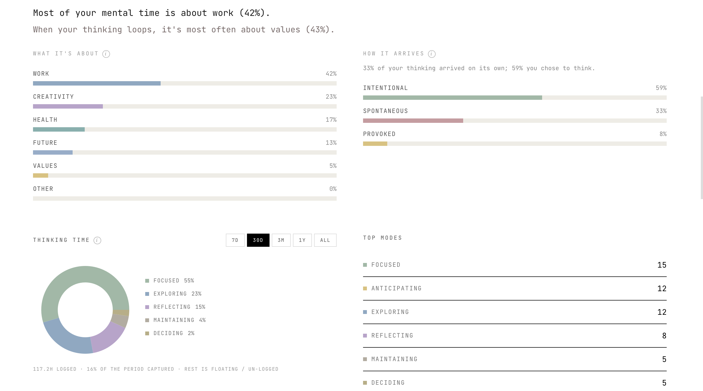
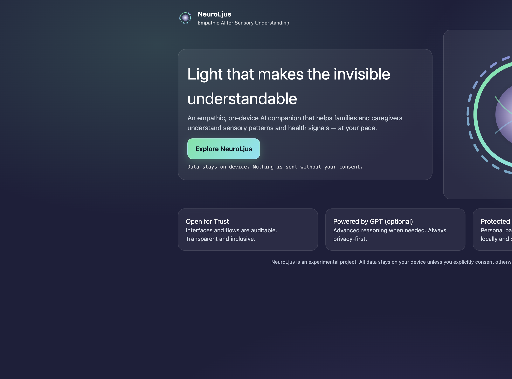

<h1 align="center">Elizabeth Ospina</h1>

  <strong>Economist (MSc)</strong> · Founder · Sweden 
  <a href="https://orcid.org/0009-0004-7291-3340">ORCID</a>

  I build <strong>measurement instruments</strong> and AI products where evidence, incentives, and privacy come first — turning complex human signals into data people can trust.

  <a href="https://neuromesure.com">neuromesure.com</a> ·
  <a href="https://neuroljus.com">neuroljus.com</a> ·
  <a href="#work">Work</a> ·
  <a href="#focus">Focus</a>

---

### Background

I am an economist (MSc in Economics) who designs and ships full-stack AI products — from measurement models and product strategy to production software. My training shapes how I work: I prioritise **what can be measured**, **what incentives apply**, and **what the evidence supports** — not opinions dressed as insight.

I work in **Spanish, English, and Swedish**, across healthtech, accessibility, and human-centred AI. I document and ship in the open, with a bias for systems that are auditable, privacy-first, and useful in real life.

<h3 id="focus">Focus</h3>

- Measurement-first product design (economics applied to behaviour and time use)
- Evidence-based AI — data shown, not advice given
- Accessibility, sensory understanding, and caregiver-facing tools
- Privacy-by-design architecture (on-device processing where it matters)

<h3 id="work">Selected work</h3>

#### [Neuromesure](https://github.com/eliospina/neuromesure) — [neuromesure.com](https://neuromesure.com)

A **measurement instrument for thought patterns**. Users describe thoughts in natural language; the system classifies them into neutral modes and returns metrics over time. Its principle: **it measures and shows data — it does not give advice.**

#### [NeuroLjus](https://github.com/eliospina/neuroljus-canon-stable) — [neuroljus.com](https://neuroljus.com)

**Empathic, privacy-first AI** for families and caregivers of non-verbal autistic individuals. Sensory signals are processed on-device; AI analysis is optional. Trilingual (ES/EN/SV), accessibility-first.

<h3>Technical scope</h3>

Production systems built with TypeScript, React, Next.js, Vite, PostgreSQL (Supabase), Stripe, and Vercel serverless functions. AI integrations (Anthropic Claude, OpenAI) run server-side only. Mobile via Capacitor; automated tests and CI on active products.

<h3 id="priorities">Current priorities</h3>

- Scaling **Neuromesure** — wearables integration, mobile delivery, deeper metrics
- Hardening **neuroljus.com** in production (recent migration to Next.js 15)
- Writing and building in public on measurable, human-centred AI

---

<em>"Ljus som gör det osynliga begripligt" — Light that makes the invisible understandable.</em>

